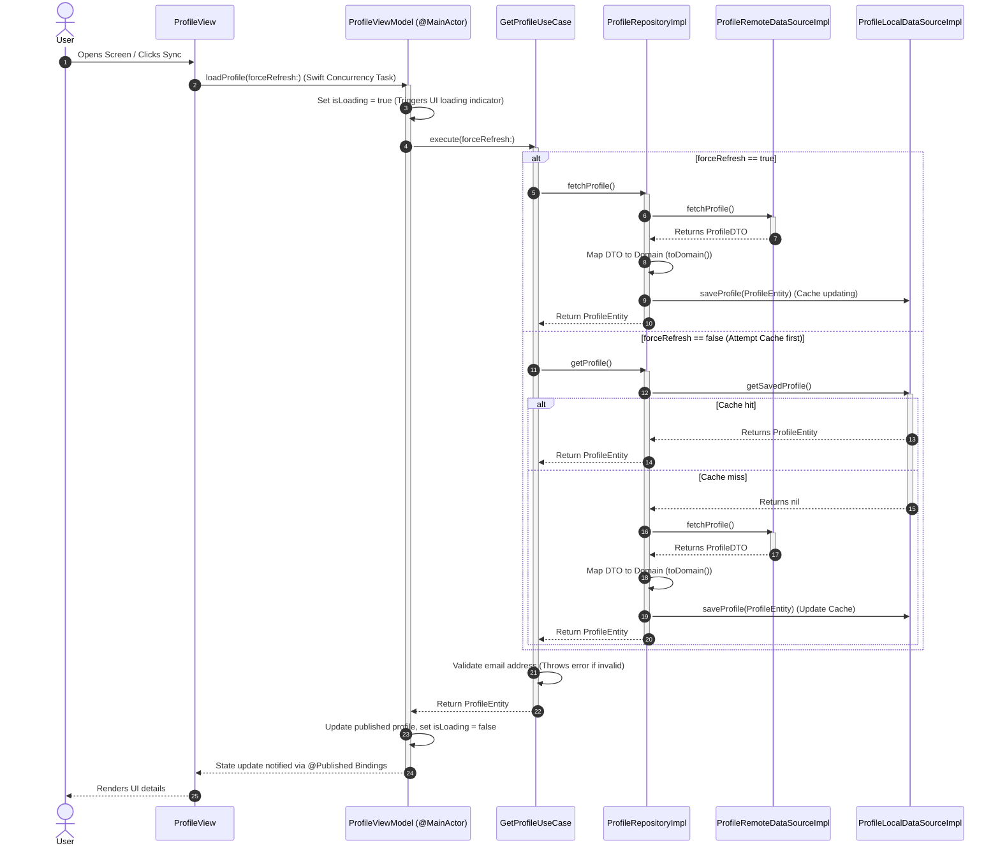

# iOS Clean Architecture Developer Guide & Reference
*Created by Meynabel Dimas Wisodewo*

This directory provides a complete, production-ready implementation of a modern iOS application architecture built around **Clean Architecture**, **MVVM-C (Model-View-ViewModel-Coordinator)**, and **modular, thread-safe Dependency Injection**.

---

## 1. Architectural Blueprint & Layer Dependencies

The architecture strictly adheres to the dependency inversion principle: **dependencies flow inward**. The core business logic (Domain) knows nothing about the UI, database, or network frameworks.

```
       ┌──────────────────────────────────────────────────────────┐
       │                       App Layer                          │
       │  (Views, ViewModels, Coordinators, Navigators, Assemblies)│
       └───────────────────────────┬──────────────────────────────┘
                                   │
                                   ▼
       ┌──────────────────────────────────────────────────────────┐
       │                       Data Layer                         │
       │ (URLSession Network Client, Local Cache, Repositories, DTOs)│
       └───────────────────────────┬──────────────────────────────┘
                                   │
                                   ▼
       ┌──────────────────────────────────────────────────────────┐
       │                      Domain Layer                        │
       │    (Pure Swift Entities, Use Cases, Repo Protocols)      │
       └──────────────────────────────────────────────────────────┘
```

*   **Domain Layer**: The core. It contains no dependencies on external frameworks, databases, or UI libraries (UIKit/SwiftUI).
*   **Data Layer**: The infrastructure. It implements repository protocols using local data storage (UserDefaults/Realm) and remote networking (URLSession/Moya).
*   **App Layer**: The presentation. It manages view layout (SwiftUI and UIKit), state (ViewModels), navigation (Coordinators), and modular registration (Assemblies).

---

## 2. Directory Structure

```filepath
ArchitectureReference/
├── ArchitectureReferences/                  # Architectural Documentation
│   ├── README.md                            # This developer guide
│   └── IMPLEMENTATION_STEPS.md              # Step-by-step developer guide
├── Dependency/                              # Dependency Injection Module
│   └── DI/
│       ├── Assembler.swift                  # Thread-safe native DI container
│       └── ProfileAssembly.swift            # Profile module dependency registrations
├── Domain/                                  # Business Logic Layer (Framework-free)
│   └── Profile/
│       ├── Entities/
│       │   └── ProfileEntity.swift          # Pure domain entity
│       ├── Repositories/
│       │   └── ProfileRepositoryProtocol.swift # Contract defined by Domain, implemented by Data
│       └── UseCases/
│           └── GetProfileUseCase.swift      # Use case for retrieving profile data
├── Data/                                    # Infrastructure Layer
│   ├── Network/
│   │   ├── APIEndpoint.swift                # Protocol-based abstract HTTP endpoint
│   │   └── NetworkClient.swift              # Decoupled network client (URLSession implementation)
│   └── Profile/
│       ├── DataSources/
│       │   ├── ProfileLocalDataSource.swift # Local disk data source (UserDefaults helper)
│       │   └── ProfileRemoteDataSource.swift # Network data source using URLSession
│       ├── Models/
│       │   └── ProfileDTO.swift             # Codable network API model + mapper
│       └── Repositories/
│           └── ProfileRepositoryImpl.swift  # Concrete repository orchestrating local & remote data
└── App/                                     # Presentation & UI Layer
    └── Features/
        └── Profile/
            ├── Navigators/
            │   ├── AppNavigator.swift       # Base navigation/coordinator protocols
            │   └── ProfileNavigator.swift   # Profile-specific navigation protocol & coordinator
            ├── ViewModel/
            │   └── ProfileViewModel.swift   # Combined SwiftUI & UIKit state controller
            └── Views/
                └── ProfileView.swift        # SwiftUI rendering implementation
```

---

## 3. Data Flow & Request-Response Sequence

Below is the step-by-step sequence flow of profile fetching operations:



---

## 4. Layer-by-Layer API & Component Reference

### A. Domain Layer (Pure Swift Business Rules)

The Domain layer defines the business entities and core rules of the application. It has zero external dependencies.

#### 1. [ProfileEntity.swift](../ArchitectureReference/Domain/Profile/Entities/ProfileEntity.swift)
A pure domain struct modeling a user profile.
```swift
struct ProfileEntity: Identifiable, Equatable {
    let id: String
    let email: String
    let firstName: String
    let lastName: String
    let phoneNumber: String
    let address: String
    let birthDate: String
    let position: String
    let avatarUrl: URL?
    
    var fullName: String {
        if firstName.isEmpty && lastName.isEmpty { return "-" }
        return "\(firstName) \(lastName)".trimmingCharacters(in: .whitespacesAndNewlines)
    }
}
```

#### 2. [ProfileRepositoryProtocol.swift](../ArchitectureReference/Domain/Profile/Repositories/ProfileRepositoryProtocol.swift)
Defines the boundary interface that the Domain requires from the Data layer.
```swift
protocol ProfileRepositoryProtocol {
    func getProfile() async throws -> ProfileEntity
    func fetchProfile() async throws -> ProfileEntity
}
```

#### 3. [GetProfileUseCase.swift](../ArchitectureReference/Domain/Profile/UseCases/GetProfileUseCase.swift)
Coordinates fetching, validates input arguments, and sorts the returned items by business priority.
```swift
final class GetProfileUseCase {
    private let repository: ProfileRepositoryProtocol
    
    init(repository: ProfileRepositoryProtocol) { self.repository = repository }
    
    func execute(forceRefresh: Bool = false) async throws -> ProfileEntity {
        let profile = forceRefresh 
            ? try await repository.fetchProfile() 
            : try (await repository.getProfile())
            
        guard profile.email.contains("@") else {
            throw ProfileDomainError.invalidEmail
        }
        return profile
    }
}
```

---

### B. Data Layer (Data Logic & Caching Infrastructure)

Handles retrieval and persistence. Bridges network models (DTOs) and local db records to pure domain structs.

#### 1. [NetworkClient.swift](../ArchitectureReference/Data/Network/NetworkClient.swift)
Defines a generic concrete implementation under a decoupled protocol. Wraps native URLSession with async/await:
```swift
protocol NetworkClient {
    func request<T: Decodable>(_ endpoint: APIEndpoint) async throws -> T
}
```

#### 2. [ProfileDTO.swift](../ArchitectureReference/Data/Profile/Models/ProfileDTO.swift)
Hybrid models incorporating mapping logic. By doing mapping directly inside DTO extension methods, we bypass boilerplate mapper classes:
```swift
struct ProfileDTO: Codable {
    let id: Int
    let email: String?
    let firstName: String?
    let lastName: String?
    // ...
    
    func toDomain() -> ProfileEntity {
        return ProfileEntity(
            id: String(id), 
            email: email ?? "", 
            firstName: firstName ?? "", 
            lastName: lastName ?? "", 
            // ...
        )
    }
}
```

#### 3. [ProfileRepositoryImpl.swift](../ArchitectureReference/Data/Profile/Repositories/ProfileRepositoryImpl.swift)
Orchestrates offline-first data sync. Tries API endpoint retrieval first; caches results locally upon success, or falls back to local storage queries if the network throws.
```swift
final class ProfileRepositoryImpl: ProfileRepositoryProtocol {
    private let remoteDataSource: ProfileRemoteDataSourceProtocol
    private let localDataSource: ProfileLocalDataSourceProtocol
    
    func getProfile() async throws -> ProfileEntity {
        if let cached = try localDataSource.getSavedProfile() {
            return cached
        }
        return try await fetchProfile()
    }
    
    func fetchProfile() async throws -> ProfileEntity {
        let dto = try await remoteDataSource.fetchProfile()
        let entity = dto.toDomain()
        try? localDataSource.saveProfile(entity)
        return entity
    }
}
```

---

### C. Dependency Injection Layer

A native Swift DI container that enforces modular registration blocks.

#### 1. [Assembler.swift](../ArchitectureReference/Dependency/DI/Assembler.swift)
Uses a thread-safe dictionary lookup wrapped by `NSRecursiveLock`. The resolution contract throws `DIError.missingDependency` rather than using fatal crashes.
```swift
final class DependencyContainer: Assembler {
    private var factories: [String: (Assembler) throws -> Any] = [:]
    private let lock = NSRecursiveLock()
    
    func resolve<T>() throws -> T {
        lock.lock()
        defer { lock.unlock() }
        
        let key = String(describing: T.self)
        guard let factory = factories[key],
              let resolvedInstance = try factory(self) as? T else {
            throw DIError.missingDependency(key)
        }
        return resolvedInstance
    }
}
```

#### 2. [ProfileAssembly.swift](../ArchitectureReference/Dependency/DI/ProfileAssembly.swift)
Registers network components, local/remote data sources, repositories, use cases, and view models:
```swift
container.register(ProfileViewModel.self) { resolver in
    return try MainActor.assumeIsolated {
        try ProfileViewModel(
            getProfileUseCase: resolver.resolve(),
            navigator: resolver.resolve()
        )
    }
}
```

---

### D. App/Presentation Layer (MVVM + Coordinator)

Coordinates navigation routing and UI layout rendering.

#### 1. [ProfileNavigator.swift](../ArchitectureReference/App/Features/Profile/Navigators/ProfileNavigator.swift)
The coordinator handles storyboard or code layout initialization, registers the assembly, and starts the flow.
```swift
final class ProfileCoordinator: Coordinator, ProfileNavigator {
    let navigationController: UINavigationController
    private let container: DependencyContainer
    
    func start() {
        let assembly = ProfileAssembly(navigator: self)
        assembly.assemble(container: container)
        
        do {
            let viewModel: ProfileViewModel = try container.resolve()
            let view = ProfileView(viewModel: viewModel)
            let hostingController = UIHostingController(rootView: view)
            navigationController.pushViewController(hostingController, animated: true)
        } catch {
            print("Coordinator Navigation Error: \(error.localizedDescription)")
        }
    }
}
```

#### 2. [ProfileViewModel.swift](../ArchitectureReference/App/Features/Profile/ViewModel/ProfileViewModel.swift)
A reactive view model declaring `@Published` properties. The class is annotated with `@MainActor` to guarantee thread-safe state modification on the UI main thread.
```swift
@MainActor
final class ProfileViewModel: ObservableObject {
    @Published private(set) var profile: ProfileEntity?
    @Published private(set) var isLoading = false
    @Published var errorMessage: String?
    
    func loadProfile(forceRefresh: Bool = false) async {
        isLoading = true
        do {
            profile = try await getProfileUseCase.execute(forceRefresh: forceRefresh)
        } catch {
            errorMessage = error.localizedDescription
        }
        isLoading = false
    }
}
```

---

## 5. Threading & Concurrency Boundaries

To keep the application responsive and avoid thread blocks or database collisions:

1.  **Main Thread UI Bindings**: All view-bound publishers inside view models are marked `@MainActor`. SwiftUI handles bindings automatically, while UIKit controllers must observe on `RunLoop.main` or `DispatchQueue.main`.
2.  **Concurrency Boundaries**: Background API requests run asynchronously using async/await. Networking data streams automatically resume to the calling async task without blocking thread execution.
3.  **Local Storage Thread Safety**: In this reference project, local storage relies on safe UserDefaults queries. If using Realm (as in production), keep in mind that Realm objects are confined to the thread they were created on. To prevent crashes, map objects to thread-safe pure Domain Struct representations (`ProfileEntity`) before crossing threads.

---

## 6. Memory Lifecycle & Retain Cycle Prevention

Clean Architecture modules contain references between ViewControllers, ViewModels, Use Cases, Repositories, and Coordinators. To prevent retain cycles:

*   **Weak Navigator references**: The ViewModel holds the Coordinator navigation delegate as `weak`:
    ```swift
    private weak var navigator: ProfileNavigator?
    ```
*   **Weak self capture inside DI container closures**: Inside assembly classes, capture lists (`[weak self]`) are declared on view model factories to ensure assemblies are not retained permanently in memory.

---

## 7. How to Add a New Feature (Step-by-Step)

When implementing a new feature, follow this strict development sequence:

### Step 1: Implement the Domain Layer
1.  Define the pure struct representation in `Domain/<Feature>/Entities/<Feature>Entity.swift`.
2.  Declare the repo protocol contract in `Domain/<Feature>/Repositories/<Feature>RepositoryProtocol.swift`.
3.  Create the isolated business use cases in `Domain/<Feature>/UseCases/Get<Feature>UseCase.swift`.

### Step 2: Implement the Data Layer
1.  Define network JSON maps in `Data/<Feature>/Models/<Feature>DTO.swift`. Provide `.toDomain()`.
2.  Create data source implementations inside `Data/<Feature>/DataSources/`.
3.  Write the repository implementation in `Data/<Feature>/Repositories/<Feature>RepositoryImpl.swift`.

### Step 3: Implement the App Layer
1.  Define navigation flows in `App/Features/<Feature>/Navigators/<Feature>Navigator.swift` (Coordinators).
2.  Create state controllers in `App/Features/<Feature>/ViewModel/<Feature>ViewModel.swift` (`@MainActor`).
3.  Write layouts in `App/Features/<Feature>/Views/` (SwiftUI).

### Step 4: Register Dependencies
1.  Create `Dependency/DI/<Feature>Assembly.swift` registering all blocks.
2.  Instantiate and trigger `assembly.assemble(container:)` in the Coordinator's `start()` method.
